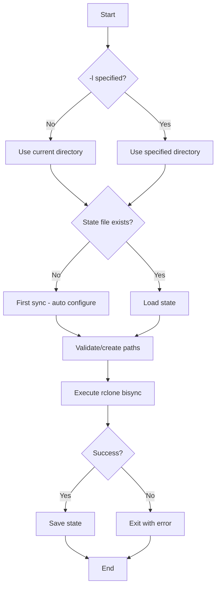

# Implementation Details

This document provides technical details about the `rdsync` implementation for developers who want to extend or modify the script.

## Architecture Overview

The script follows a modular design with clear separation of concerns:

```
┌─────────────────┐    ┌─────────────────┐    ┌─────────────────┐
│  Argument       │────│  State          │────│  Validation &   │
│  Parsing        │    │  Management     │    │  Execution      │
└─────────────────┘    └─────────────────┘    └─────────────────┘
```

## Core Components

### 1. Configuration & Defaults (Lines 9-26)
```bash
DEFAULT_LOCAL_DIR=""
DEFAULT_REMOTE_NAME="dropbox"
DEFAULT_LOG_DIR="$HOME/.rclone-sync/logs"
# ... other defaults
```

**Key Design Decisions:**
- Logs centralized in `~/.rclone-sync/logs/` (user-specific)
- State files stored per-directory (`.rclone-sync-state`)
- Filter files stored per-directory (`.rclone-filters.txt`)

### 2. State Management (Lines 90-177)

#### State File Format
```bash
# .rclone-sync-state
REMOTE_NAME="dropbox"
REMOTE_DIR="my-folder"
REMOTE_PATH="dropbox:my-folder"
LAST_SYNC="2025-07-26 12:52:42"
```

#### Key Functions
- `save_state()` - Persists configuration after successful sync
- `load_state()` - Retrieves configuration for subsequent syncs
- `reset_state()` - Removes state file
- `determine_remote_path()` - Smart path resolution with auto-configuration

**Auto-Configuration Logic:**
```bash
if [[ ! -f "$STATE_FILE" ]]; then
    # First run - auto-enable --resync
    RESYNC=true
fi
```

### 3. Path Validation & Auto-Creation (Lines 225-265)

#### Smart Remote Directory Handling
```bash
if ! rclone lsd "$remote_path" >/dev/null 2>&1; then
    if [[ "$RESYNC" = true ]]; then
        # First sync - create remote directory
        rclone mkdir "$remote_path"
    else
        # Subsequent sync - directory should exist
        exit 1
    fi
fi
```

### 4. Command Building (Lines 340-380)

The `build_rclone_command()` function dynamically constructs rclone arguments:

```bash
cmd_args+=("bisync")
cmd_args+=("$local_dir")
cmd_args+=("$remote_path")

# Conditional flags based on state
if [[ "$DRY_RUN" = true ]]; then
    cmd_args+=("--dry-run")
fi
```

## Extension Points

### Adding New Flags

1. **Add variable declaration:**
```bash
NEW_FEATURE=false
```

2. **Add argument parsing:**
```bash
--new-feature)
    NEW_FEATURE=true
    shift
    ;;
```

3. **Add to command builder:**
```bash
if [[ "$NEW_FEATURE" = true ]]; then
    cmd_args+=("--new-feature")
fi
```

4. **Update help text:**
```bash
  --new-feature              Description of new feature
```

### Adding New Remote Providers

The script is designed around rclone, so adding new providers is straightforward:

1. **Change default remote:**
```bash
DEFAULT_REMOTE_NAME="gdrive"  # or "onedrive", "s3", etc.
```

2. **Provider-specific filters:**
```bash
create_provider_filters() {
    case "$REMOTE_NAME" in
        dropbox)
            # Dropbox-specific exclusions
            ;;
        gdrive)
            # Google Drive-specific exclusions
            ;;
    esac
}
```

### Adding New Commands

Follow the `--list-remote` pattern:

1. **Add flag parsing:**
```bash
--new-command)
    NEW_COMMAND=true
    shift
    ;;
```

2. **Add early handling:**
```bash
if [[ "$NEW_COMMAND" = true ]]; then
    # Handle command logic
    exit 0
fi
```

## State Flow



## Error Handling Strategy

### Validation Errors (Exit Code 1)
- Missing required parameters
- Invalid directories
- Remote connectivity issues

### Rclone Errors (Rclone Exit Code)
- Sync conflicts
- Permission issues
- Network problems

### Safety Aborts
- Mass deletion detection (requires `--force`)
- Access check failures

## Testing Strategy

### Manual Testing Commands
```bash
# Test first sync
mkdir test-dir && cd test-dir
rdsync -d test-remote

# Test subsequent sync
rdsync

# Test error conditions
rdsync  # From directory without state

# Test dry run
rdsync --dry-run

# Test list remote
rdsync --list-remote
```

### Edge Cases to Test
1. Remote directory doesn't exist (should auto-create)
2. State file corrupted (should fail gracefully)
3. Network connectivity issues
4. Permission problems
5. Very large syncs (progress reporting)

## Performance Considerations

### Logging
- Daily log files prevent excessive file creation
- Session separators make debugging easier
- Log level configurable via rclone flags

### State Management
- Minimal state file format
- Per-directory isolation
- No global configuration pollution

### Network Efficiency
- Leverages rclone's built-in optimizations
- Bisync algorithm for minimal transfers
- Progress reporting for large operations

## Security Considerations

### Credential Handling
- Relies on rclone's credential management
- No secrets stored in state files
- Uses system-level rclone configuration

### Path Validation
- Absolute path resolution
- Input sanitization for remote paths
- Protection against path traversal

### Filter Security
- Default exclusions prevent sensitive files
- Per-directory filter customization
- System file protection

## Debugging

### Enable Verbose Output
```bash
rdsync --verbose
```

### Check Logs
```bash
tail -f ~/.rclone-sync/logs/rclone-$(date '+%Y-%m-%d').log
```

### Dry Run Analysis
```bash
rdsync --dry-run
```

### State Inspection
```bash
cat .rclone-sync-state
```

## Future Enhancement Ideas

1. **Configuration File Support**: Global config file for defaults
2. **Multiple Remote Support**: Sync to multiple destinations
3. **Scheduling Integration**: Cron job generation
4. **Conflict Resolution**: Interactive conflict handling
5. **Progress Hooks**: Custom scripts on sync events
6. **Backup Rotation**: Automatic backup versioning
7. **Encryption Support**: Built-in encryption layer
8. **WebUI**: Simple web interface for monitoring

## Contributing Guidelines

1. Maintain backwards compatibility
2. Follow existing error handling patterns
3. Update help text for new features
4. Add tests for new functionality
5. Document new extension points
6. Keep the git-like workflow philosophy